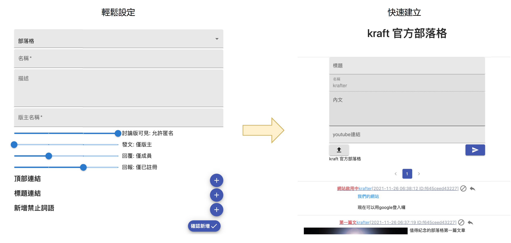
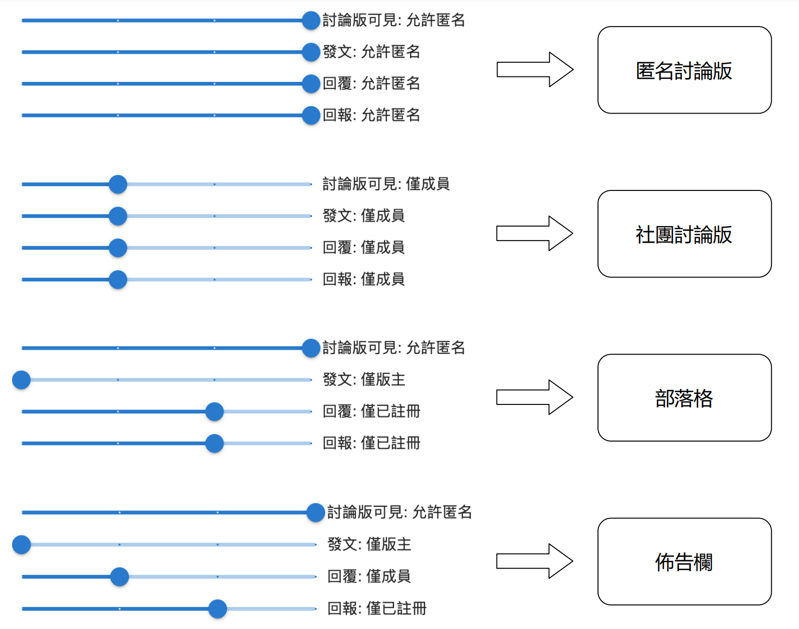
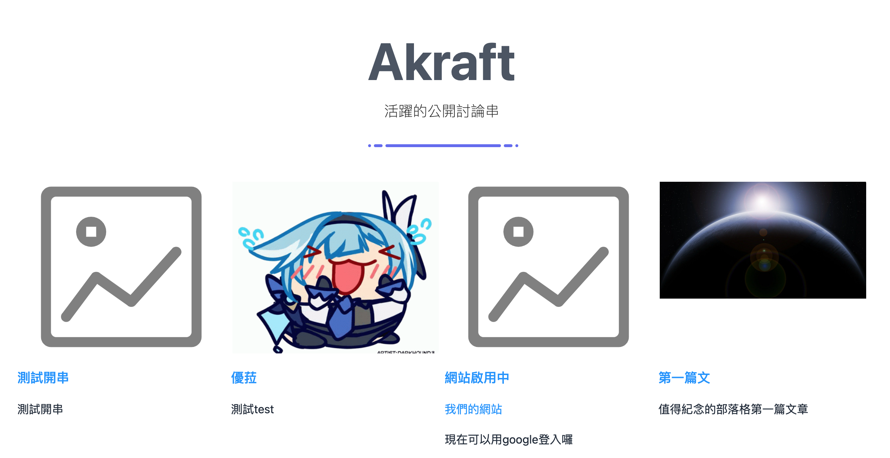

# Akraft

## 簡述

> [Akraft](https://komica-saas.vercel.app) 是一個極簡的架站平台



```
輕鬆設定,快速建立是我們的信條
```

## 公司目標或願景

> 我們希望成為台灣最大的架站平台

- 我們已經做出有在營運的網站, 為了推廣這個服務, 也為了公司的成長決定募資
- 我們結合了部落格, 討論版, 社團的市場, 藉此來做市場整合
- 同時解決 Dcard, Discord, Reddit 等常見社群的痛點, 以此來吸引用戶
- 目標為五年內達到用戶數 100 萬
  - 會主動開啟討論的主動型用戶可以註冊後建立討論版
  - 不主動開啟話題的被動型用戶也可以輕鬆地回應

## 市場概述

### web blog

blog 這個詞源來自 web log,原本專指人們於網路上留下的訊息  
隨後這種個人出版形式變成一種網站的類型  
逐漸成為社群網路媒體的一部分

隨著社群媒體的發達,人們對於將自己意見表達於網路上的需求也逐漸增加  
除了最早的部落格,也衍生出留言板,論壇等等方式  
用戶"被看見"的需求不斷地增加

### 個人媒體

Facebook 面世後,由於新型媒體的優勢快速累積大量的用戶  
用戶們再也不必辛苦的自己架站,也不必等待其他用戶進到自己的網站查看訊息  
因為用戶與用戶之間的連結,系統將會自動將用戶的訊息發布到其他用戶的動態訊息上  
此舉造成來不及轉型的舊型社群媒體消失,以台灣為例就是於 2013 年終止服務的無名小站

但是隨著用戶的增多,以及分享訊息的隨意性  
導致用戶想看的關鍵訊息可能一下子就從動態訊息上消失  
鎖定這點推出的 Instagram 便讓發布的訊息沒辦法隨意地被轉傳  
讓真正需要相關資訊的用戶只能找真正發布訊息的用戶追蹤  
發布訊息的用戶也不會因為轉傳的功能而損失流量

### 特定族群媒體

近年來隨著國內 Dcard, 國外 Discord/Slack 等平台的興起  
Dcard (一開始)針對學生族群  
Discord 針對遊戲族群  
Slack 針對企業用戶  
這些平台的興起顯示用戶在針對特定話題時傾向於找尋特定的族群  
而非如個人媒體將所有類型的訊息發布到同一版面上

### 我們的看法

現在是一個流量的時代, 人們會自然而然地往流量而去  
不管是資訊提供者, 還是一般用戶  
因此, 我們認為與其讓各種類型的社群媒體互相競爭用戶  
不如建立一個通用性的平台,吸引各種類型的用戶,將流量集中  
這也是我們 Akraft 提出的方案

### 通用性社群媒體

- 我們提供了自定義的權限設定,根據不同的設定將可以提供不同社群媒體的功能  
  

- 我們也提供了針對用戶的動態牆,打造完善的社群功能
  

## 技術及產品敘述

### SAAS

> 根據預測，全球的軟體即服務 (SaaS) 商業模式可望達到 997 億美元的成長 - Azure

Akraft 提供 SAAS 服務, 使用者只需透過手機或電腦等瀏覽器即可享有整套服務  
不必自己控管程式碼及伺服器的硬體

### SEO

由於我們有提供網誌及討論版等需要做搜尋引擎最佳化的服務  
因此我們採用 Next js 作為開發的框架,藉由 SSR 來提供對應的 SEO

### PAAS / CICD

我們使用 Vercel 來部署服務  
節省伺服器維護成本的同時為了因應現代軟體的快速迭代,持續集成/持續部署也相當重要  
Vercel 的 CICD 讓我們可以有更快速持續開發及測試新功能的能力

### DAAS

資料庫方面我們使用 MongoDB Atlas 的 DAAS 服務  
減少自行架設伺服器的營運及維護成本  
同時 NoSQL 的特性也讓我們在開發上有更多的彈性

### firebase

使用者驗證方面,由於近年來資安事件頻傳  
為了減少帳號及密碼被盜用的風險,我們採用 firebase 提供的帳號驗證服務

### Cloudflare Images

由於我們提供每個發文者皆有上傳圖片的權利  
因此在我們網站上最佔流量的檔案將會是圖片  
我們採用 Cloudflare 提供的 Images 服務,除了減少維護網路空間的費用外  
Images 還提供了對同一張圖片不同大小變體的免費服務  
同時 CDN 的功能也讓使用者可以更快速的得到圖片

## 競爭比較

### 討論版

|          |                Dcard                |       Discord / Slack       |                         Akraft                          |
| :------: | :---------------------------------: | :-------------------------: | :-----------------------------------------------------: |
| 開設版面 |          開設困難,需要申請          |          開設容易           |                        開設容易                         |
| 版面開放 | 版面屬於開放狀態,但需要註冊才可回應 |      版面屬於隱私狀態       |                    版主可以自行決定                     |
| 話題展開 |     容易在同一版面開始新的話題      | 由於頻道設定,舊文容易被洗掉 | 話題的順序會隨著回應時間排序,用戶隨時會看到最熱門的討論 |

### Blog

|                  |    Blogger     |        Pixnet 痞客邦        |        WordPress / Wix         |             Akraft             |
| :--------------: | :------------: | :-------------------------: | :----------------------------: | :----------------------------: |
|     架設難度     |      容易      |            一般             |        需有基本程式概念        |              容易              |
|     前台介面     |      單調      |          廣告較多           |      一般,根據管理員定義       |              簡單              |
|      互動性      | 不容易被人看到 | 廣告及業配過多,無法過濾用戶 | 版主需要完全自己管理自己的用戶 | 所有版面共通用戶更容易互通有無 |
| 允許限定用戶查看 |       -        |              -              |        需要自行添加功能        |         後台有權限設定         |

## 經營團隊

### 公司成員

- 我們目前已經有成立公司,公司共四名董事兼工程師

### 公司成績

- 我們在接案期曾做過 App 網站 伺服器的架設
- 對於如何架構及營運網路服務有一定經驗
- Akraft 也是已經做出產品後才推出募資

## 募資計畫

> 由於產品已經完成並上線,因此我們目前需要的是廣告基金

1. 第一階段
   1. 項目啟動基金約十萬(網址,營業登記等)
   2. 50~100 萬作為廣告基金
   3. 營運初期,由於流量及圖片儲存成本都不高,因此所需營運成本大約 10000/mo
2. 當用戶數來到一萬後才會進入第二階段
   1. 這個階段我們才會開發 App 及升級版本(subdomain 服務及圖片大小上限提升)
   2. 此階段預估投入兩名工程師,PM 及測試人員各一名,時程預估兩個月
   3. 預估成本: 30,0000~40,0000
3. 第三階段,此時我們用戶數已經到達十萬
   1. 此時需要增加各種線上/線下活動,因此需要規劃營運團隊
   2. 規劃新話題,處理營運事務
   3. 預估成本 12 萬/月
4. 第四階段,用戶數來到一百萬
   1. 為了增加市場我們會開始於國外網站投放廣告(目前已有多國語系,沒有額外開發成本)
   2. 此階段基金預估 100~200 萬

## 財務預估

### 第三方服務成本

- 網站基本成本: vercel $20/mo
- 資料庫基本成本: 80GB Storage, 15GB Ram, 4vCPUs, $619/mo
- 網站流量成本: 1TB Free, $55/100G Extra
- 圖片儲存成本: 10 萬張/$5
- 圖片流量成本: 10 萬張/$1

### 營運成本

- 一次性費用
  - 網址 600/年
  - IG 廣告費用 CPM \* 1000: 15 萬
  - Youtuber 業配 10 萬 x5: 50 萬
- 營運團隊
  - 企劃 x1 客服 x1
  - 相關開支等約十二萬/月
- 服務營運成本
  - 計算環境,Dcard 100 萬註冊用戶時活躍用戶為 5 萬,每日發文數 5000
  - 假設每個活躍用戶每天瀏覽 20 個頁面 => 5 萬 x20x2MB = 2TB
    - 流量費用為$550/mo
  - 20 頁面設定為 500 張圖 => 5 萬 x 500 = 2500 萬
    - 圖片流量成本: $250/mo
  - 設定 5000 發文有一半附圖 => 每日圖片 2500
    - 營運一年為$45/mo 成本 (隨時間增加)
  - 基本成本 vercel + mongodb atlas = $639
  - 總成本 $1484/mo = NT 44520/mo

### 收益

- google AdSense
  - $19,0000/150 萬瀏覽量/月
- 版主數:1000 設定其中兩成也就是 200 人為付費訂閱用戶
  - 付費用戶我們將提供 subdomain 及圖片上傳檔案大小上限限制(不會增加營運成本)
  - 200 x 1000 = 20,0000

### 淨利

- 390000-120000-44520=225480 (mo)

## 風險分析

### SWOT 分析

- 優勢:
  - 將營運的 Server 架設於有公信力上的服務上,減少內部人員維護成本,
  - 公司內部採用 CICD 增加產品迭代速度,
  - 需求使用 BDD 開發模式讓需求單位,研發單位及測試單位成為一條產品線,加快開發速度
- 弱點
  - 對於產品行銷能力不足,我們需要學習與改進
  - 未來市場觀瞻洞察力需要精進
- 機會
  - 在 Dcard 過於開放及 Discord 過於封閉的環境中,我們採取中間策略,獲取中間層的用戶
  - 統一性成為一種未來趨勢,當自己的網誌與想參與的討論版位於同一網站可以增加用戶留存度
- 威脅
  - Dcard 隨時可能回頭做出隱私社團功能
  - SAAS 的蓬勃發展可能使得後進以更快的速度崛起

### 未來第三方服務走向分析

- Vercel 為市面上最大的 Next js 專案部署商,應該無需擔心停止營運
  - 需要擔心的事情為營運成本的漲價
- Cloudflare 為市面上最大的 CDN 供應商,無須擔心停止營運
  - Image 為新推出的服務(直至去年都還在 Beta)
  - 為此需要有漲價及 Api 更新的準備
- MongoDB Atlas 為目前市面上最大的 MongoDB 部署商,無須擔心停止營運
  - 台灣具有原廠的營運服務,且可以將服務架設在台灣的 GCP 上,無須擔心反應速度
  - 目前價格已維持多年,暫時毋須擔心漲價

## 其他
